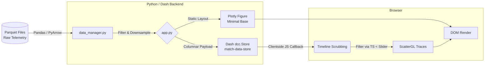

# Architecture & Technical Documentation

## 1. System Pipeline

The data flows from raw game telemetry directly to the interactive browser client, leaning heavily on vectorized transformations and client-side GPU acceleration.



---

## 2. Technology Stack & Rationale

| Technology | Purpose | Rationale |
| :--- | :--- | :--- |
| **Dash (Python)** | Framework & Routing | Allowed for rapid prototyping and iteration in a primarily Python-centric data science ecology without setting up full Node.js/React tooling. |
| **Plotly.js (ScatterGL)** | WebGL Rendering Core | Standard SVG plotting crashed browsers past 3,000 points. ScatterGL shifts the rendering workload to the GPU, guaranteeing 60FPS even when plotting full-match telemetry datasets. |
| **Pandas + PyArrow** | Data Ingestion | PyArrow is perfectly integrated with Pandas to rapidly stream massive parquet files directly into memory format with vectorized datetime math. |

### Technical Trade-offs
1. **Dash for React Prototyping vs Native React build:** We traded granular component lifecycle control for development speed. Overriding Dash's baked-in Bootstrap and React-Select inline CSS required heavy CSS-specificity tuning and JS MutationObservers.
2. **Pre-loading Payload vs Lazy Loading:** The backend serializes the *entire* match into a JSON dictionary within `dcc.Store` on initial map selection. While this slightly increases initial memory load (browser side), it guarantees absolutely zero network latency during timeline scrubbing.

---

## 4. Performance Optimization

Achieving 60FPS fluid scrubbing on large telemetry datasets natively in the browser is challenging. We utilize a combination of two specific techniques:
1. **Zero-Latency Seeking via `dcc.Store`:** By serializing the full match coordinate payload into `match-data-store` once during the map load, we remove all Python backend round-trips from the playback equation. The scrubber leverages Dash's `clientside_callback` functionality to execute filtering directly in the Javascript VM.
2. **ScatterGL Sub-rendering:** Using GPU-accelerated WebGL layers handles rendering logic off the main CPU thread, allowing markers and high-density paths to be painted without blocking DOM interactions like slider drags.

---

## 3. Coordinate Mapping Deep-Dive

Mapping a 3D persistent world matrix down to a static 2D image is mathematically tedious primarily because Unity/Unreal Engine coordinate axes often mismatch SVG coordinate standards.

**The Problem:**
1. Unity uses `(X, Y, Z)` where `Y` is elevation. The 2D top-down minimap concerns itself only with `X` (horizontal) and `Z` (vertical).
2. Browser image coordinates `(0, 0)` start at the **top-left**. Game world coordinates `(0, 0)` generally start at the **bottom-left** (or center).

**The Solution:**
We execute the translation in `_get_pixel_coords` with an inverted `v` calculation.

```python
u = (x - origin_x) / scale
v = (z - origin_z) / scale

pixel_x = u * 1024
pixel_y = (1 - v) * 1024  # Inverted Y-Axis
```

- **Origin Shifting:** Subtracting the `origin` shifts the game coordinates so the bottom-left corner sits exactly at `0`.
- **Scaling to Normalized Vector (U, V):** Dividing by `scale` turns our raw meters (e.g., `-370` to `530`) into floating-point decimals from `0.0` to `1.0`.
- **Inversion & Scaling to Pixel:** Because our HTML `div`/Image is `1024px` tall, `(1 - v)` flips the vertical orientation so our trajectory points perfectly lock to the high-res static map topology overlay.
